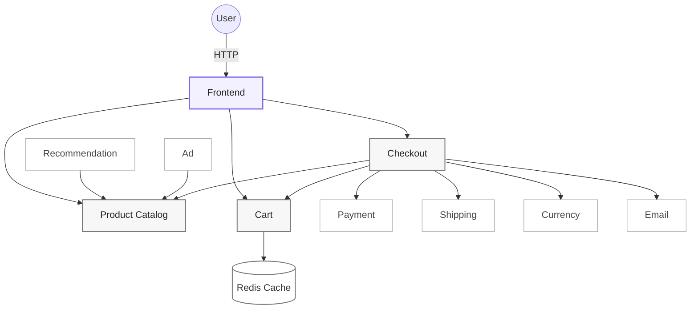

# CampusLoop


CampusLoop is a full-stack campus resale marketplace built for Northeastern students. It supports product discovery, listings, reservations, seller-confirmed handoffs, and account workflows through a containerized microservices architecture.

Application: [https://neuloop.vercel.app](https://neuloop.vercel.app)

## Architecture

CampusLoop uses a microservices architecture centered around a Go web frontend and independently deployable commerce services. Core marketplace flows—product discovery, cart management, and checkout—communicate with supporting services for recommendations, payments, shipping, currency conversion, and email confirmation.



| Service | Technology | Responsibility |
| --- | --- | --- |
| frontend | Go, HTML, CSS, JavaScript | Serves the marketplace UI and user-facing flows. |
| productcatalogservice | Go | Manages and serves marketplace product listings. |
| cartservice | C# + Redis | Manages cart state with Redis-backed storage. |
| checkoutservice | Go | Orchestrates checkout across cart, payment, shipping, and email services. |
| recommendationservice | Python | Generates related-item recommendations. |
| currencyservice | Node.js | Handles currency conversion. |
| paymentservice | Node.js | Processes mock payments for checkout. |
| shippingservice | Go | Provides mock shipping quotes and tracking. |
| emailservice | Python | Generates mock order confirmation emails. |
| adservice | Java | Serves promotional content. |

## Screenshots

| Marketplace Home | Product Detail |
| --- | --- |
| [Open homepage](https://neuloop.vercel.app) | [Open product page](https://neuloop.vercel.app/product/66VCHSJNUP) |

## Quickstart

```bash
git clone https://github.com/Ruoxi-0812/CampusLoop.git
cd CampusLoop
kind create cluster --name campusloop
kubectl apply -f release/kubernetes-manifests.yaml
kubectl port-forward deployment/frontend 8081:8080
```

Open the app:

```text
http://127.0.0.1:8081
```

## Local Development

Frontend:

```bash
cd src/frontend
go run .
```

Static demo:

```bash
cd vercel-demo
vercel dev
```

Kubernetes:

```bash
kubectl apply -f release/kubernetes-manifests.yaml
kubectl get pods
kubectl port-forward deployment/frontend 8081:8080
```

## Deployment

- Web hosting: Vercel
- Full microservices runtime: Kubernetes
- Local Kubernetes environment: Kind
- Containerization and deployment: Docker, Kubernetes, and Skaffold

## Attribution

CampusLoop is built on top of the open-source [GoogleCloudPlatform/microservices-demo](https://github.com/GoogleCloudPlatform/microservices-demo), licensed under Apache License 2.0.
