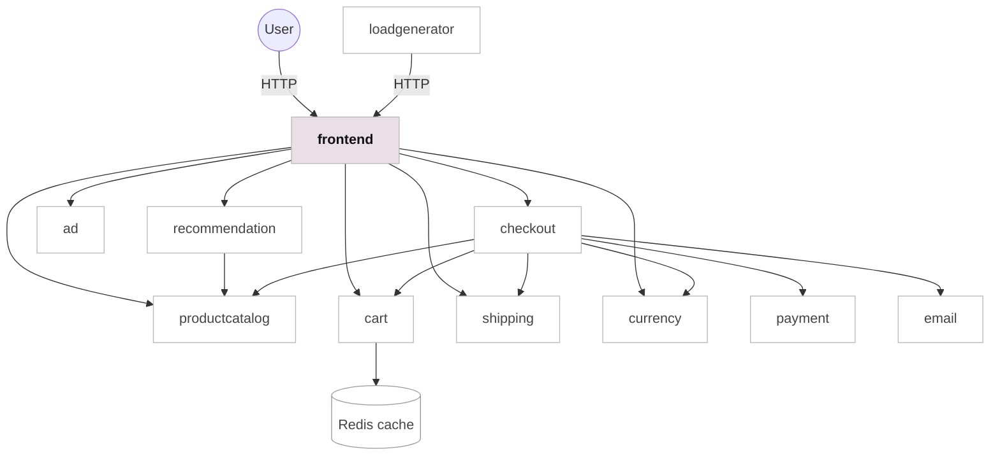

# CampusLoop

CampusLoop is a student-to-student second-hand marketplace for Northeastern University students. Students can browse used textbooks, dorm essentials, furniture, electronics, clothing, and daily supplies, then coordinate campus pickup with a seller.

Application: [https://neuloop.vercel.app](https://neuloop.vercel.app)

## Architecture

CampusLoop is organized around a Go frontend and a set of commerce microservices for product catalog, cart, checkout, recommendations, ads, currency conversion, payment, shipping, and email confirmation. The current Vercel deployment provides a static resume-ready demo of the marketplace UI, while the full project keeps the Kubernetes microservices structure for local or cloud deployment.



| Service | Technology | Description |
| --- | --- | --- |
| frontend | Go templates, HTML, CSS, JavaScript | CampusLoop web UI for browsing, product details, account state, messages, listings, and post-item pages. |
| productcatalogservice | Go | Provides campus resale listings from the product catalog. |
| cartservice | C# + Redis | Stores and retrieves cart data. |
| checkoutservice | Go | Coordinates checkout, payment, shipping, and email confirmation. |
| currencyservice | Node.js | Converts listing prices between supported currencies. |
| paymentservice | Node.js | Provides mock payment behavior for checkout. |
| shippingservice | Go | Provides mock shipping quotes and tracking behavior. |
| emailservice | Python | Sends mock order confirmation emails. |
| recommendationservice | Python | Recommends related marketplace items. |
| adservice | Java | Provides promotional messages for the storefront. |
| deployment | Vercel + Kubernetes | Vercel hosts the static demo; Kubernetes manifests run the full microservices version. |

## Screenshots

| Marketplace Home | Product Detail |
| --- | --- |
| [Open homepage](https://neuloop.vercel.app) | [Open product page](https://neuloop.vercel.app/product/66VCHSJNUP) |

## Quickstart

```bash
git clone https://github.com/Ruoxi-0812/CampusLoop.git
cd CampusLoop
kind create cluster --name campusloop
kubectl apply -f release/kubernetes-manifests.yaml
kubectl port-forward deployment/frontend 8081:8080
```

Open the app:

```text
http://127.0.0.1:8081
```

## Local Development

Frontend:

```bash
cd src/frontend
go run .
```

Static demo:

```bash
cd vercel-demo
vercel dev
```

Kubernetes:

```bash
kubectl apply -f release/kubernetes-manifests.yaml
kubectl get pods
kubectl port-forward deployment/frontend 8081:8080
```

## Deployment

- Static demo: Vercel
- Production URL: [https://neuloop.vercel.app](https://neuloop.vercel.app)
- Vercel root directory: `vercel-demo`
- Full service runtime: Kubernetes
- Local cluster: Kind
- Service manifests: `release/kubernetes-manifests.yaml`
- Container workflow: Docker and Skaffold

The Vercel version is intentionally static so the project can be viewed reliably from a resume link without keeping a paid Kubernetes cluster running.

## Documentation

- [Static Vercel demo](vercel-demo)
- [Frontend templates](src/frontend/templates)
- [Frontend styles](src/frontend/static/styles/styles.css)
- [Product catalog](src/productcatalogservice/products.json)
- [Protocol Buffers API](protos/demo.proto)
- [Kubernetes manifests](release/kubernetes-manifests.yaml)

## Attribution

This project adapts the open-source [GoogleCloudPlatform/microservices-demo](https://github.com/GoogleCloudPlatform/microservices-demo) architecture and reworks it into a Northeastern-focused campus marketplace experience. The original project is licensed under the Apache License 2.0.
